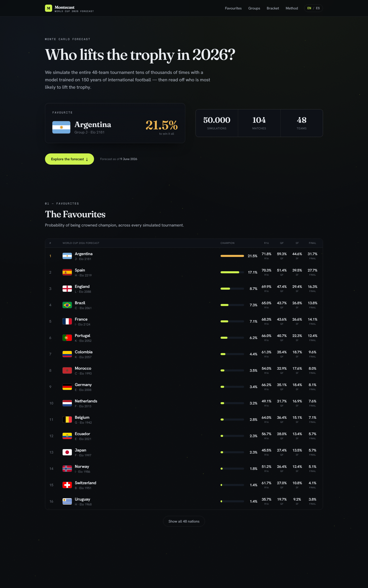

<div align="center">

# ⚽ Montecast

### Who lifts the trophy in 2026?

**A Monte Carlo engine that forecasts the FIFA World Cup 2026 by simulating the entire
48‑team tournament 50,000 times** — from a model trained on ~150 years of international
football — and reading off every nation's odds of reaching each stage.

[](https://montecast.vercel.app)
[](https://nextjs.org)
[](https://www.python.org)
[](LICENSE)

<br/>



</div>

---

## What is this?

Most "bracket predictors" pick a single winner. **Montecast is a real forecasting engine.**
It estimates how strong every team is, plays out the whole tournament — group fixtures,
FIFA tiebreakers, the eight best third‑placed teams, the official Round‑of‑32 bracket —
**tens of thousands of times**, and aggregates the results into calibrated probabilities:
*Argentina 21.5% to win it all, 97.7% to escape the group,* and so on for all 48 nations.

The engine is Python; the site is a fast, bilingual (EN/ES) Next.js app. Upsets are the
point — the numbers are honest probabilities, not predictions of certainty.

## How the forecast works

| # | Step | What happens |
|---|------|--------------|
| **1** | **Team strength** | A time‑weighted **Dixon‑Coles** bivariate‑Poisson model estimates each nation's attack & defence from results since 1872 (recent games weigh more), blended with an **international Elo** rating. |
| **2** | **Every scoreline** | For any matchup the model returns a full **distribution over scorelines** — including the Dixon‑Coles low‑score correction and home advantage — not just win/draw/loss. |
| **3** | **50,000 tournaments** | A vectorised **Monte Carlo** simulator plays the real fixtures, applies FIFA tiebreakers, selects the best thirds and solves the official bracket, all the way to a champion. |
| **4** | **Honest probabilities** | Aggregating millions of simulated matches yields **calibrated odds** for every stage, for every team. |

## Architecture

```
              ┌──────────────────────── engine/ (Python) ────────────────────────┐
 results.csv  │  ingest → Elo  ┐                                                   │
 (1872→today) │               ├─► Ensemble ─► Monte Carlo (50k) ─► JSON export ────┼─►  web/public/data/*.json
 wc2026.json  │  Dixon‑Coles ─┘                                                    │            │
              └───────────────────────────────────────────────────────────────────┘            ▼
                                                                          web/ (Next.js 16) renders the
                                                                          forecast as a static site → Vercel
```

The engine writes five JSON artifacts (`meta`, `teams`, `simulation`, `groups`, `bracket`);
the web app reads them at build time and ships a fully static, instantly‑loading site.

## Tech stack

- **Engine** — Python 3.11 · NumPy · pandas · SciPy · scikit‑learn (optional XGBoost layer)
- **Web** — Next.js 16 · React 19 · TypeScript · Tailwind CSS v4
- **Models** — Dixon‑Coles bivariate‑Poisson · international Elo · Monte Carlo simulation
- **Deploy** — Vercel (static export)

## Project structure

```
montecast/
├── engine/                     # Python forecasting engine
│   └── src/montecast/
│       ├── ingest/             # load & clean 150 yrs of results
│       ├── models/             # elo · dixon_coles · ensemble
│       ├── simulate/           # monte_carlo · tiebreakers · bracket
│       ├── export/             # JSON artifacts for the web
│       └── pipeline.py         # end-to-end CLI
└── web/                        # Next.js front-end
    ├── public/data/*.json      # generated forecast (committed)
    └── src/                    # app · components · i18n · types
```

## Run it locally

### Web (the forecast site)

The latest forecast JSON is committed, so the site runs without touching Python:

```bash
cd web
npm install
npm run dev        # → http://localhost:3000
```

### Engine (regenerate the forecast)

```bash
cd engine
pip install -e .                      # installs the `montecast` package
# place the dataset in engine/data/raw/ (see below), then:
python -m montecast.pipeline --n-sims 50000
# writes the five JSON files into web/public/data/
```

Useful flags: `--as-of YYYY-MM-DD` (forecast/backtest date) · `--n-sims` · `--seed`.

### Data

The engine trains on the community‑maintained **[International football results, 1872→present](https://www.kaggle.com/datasets/martj42/international-football-results-from-1872-to-2017)**
dataset. Drop `results.csv`, `shootouts.csv` and `former_names.csv` into `engine/data/raw/`.
The raw data is git‑ignored (it's large and regularly updated upstream); the generated
forecast it produces is committed under `web/public/data/`.

## Roadmap

See **[ROADMAP.md](ROADMAP.md)** — calibration backtests, per‑match detail, and automatic
re‑forecasting as real 2026 results arrive.

## License

[MIT](LICENSE) © Juan Morales. Forecasts are probabilistic — and upsets are the point.
